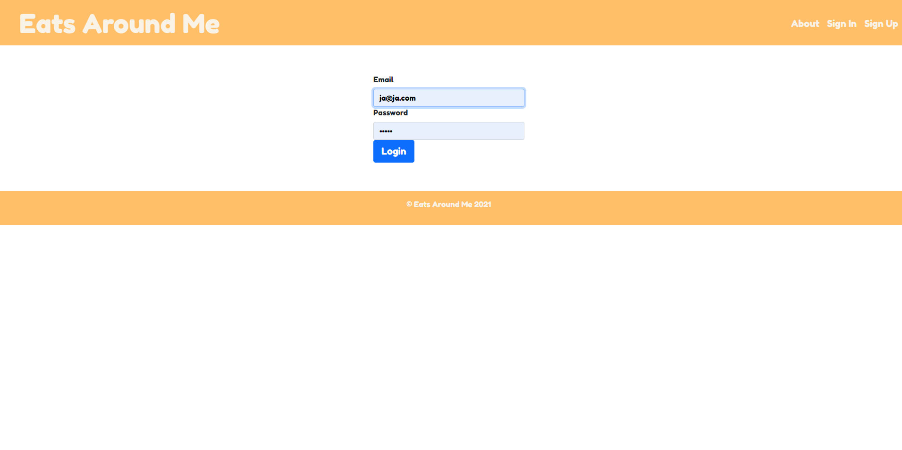
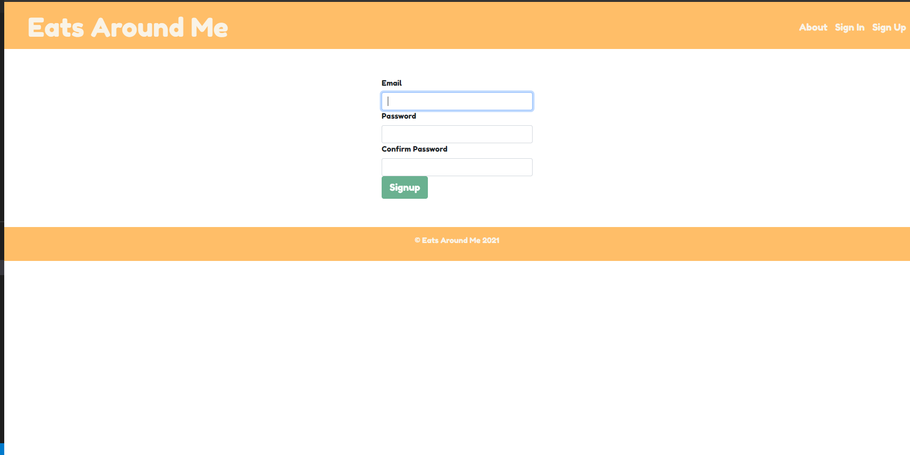
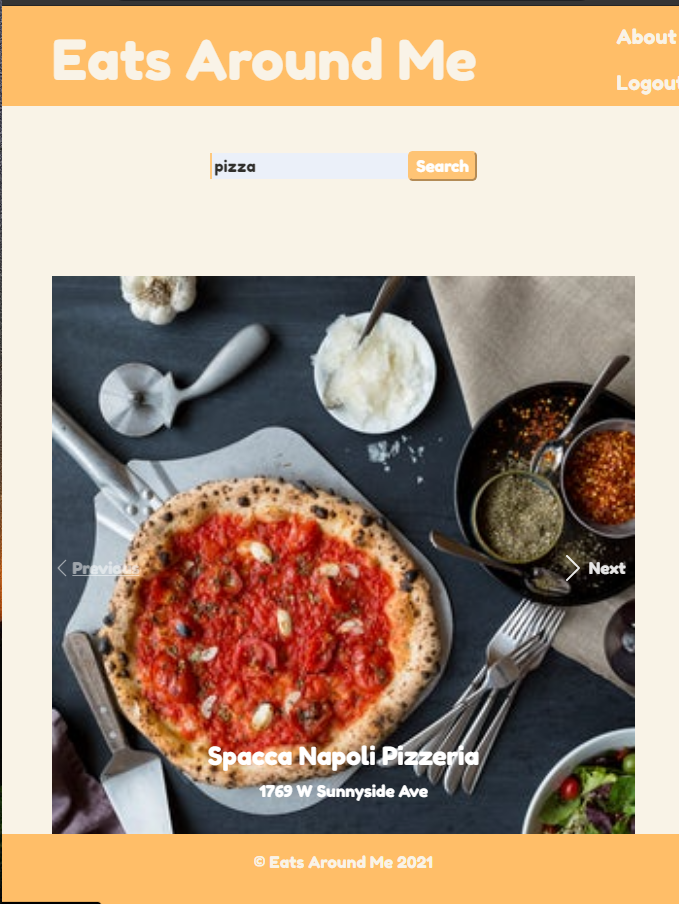
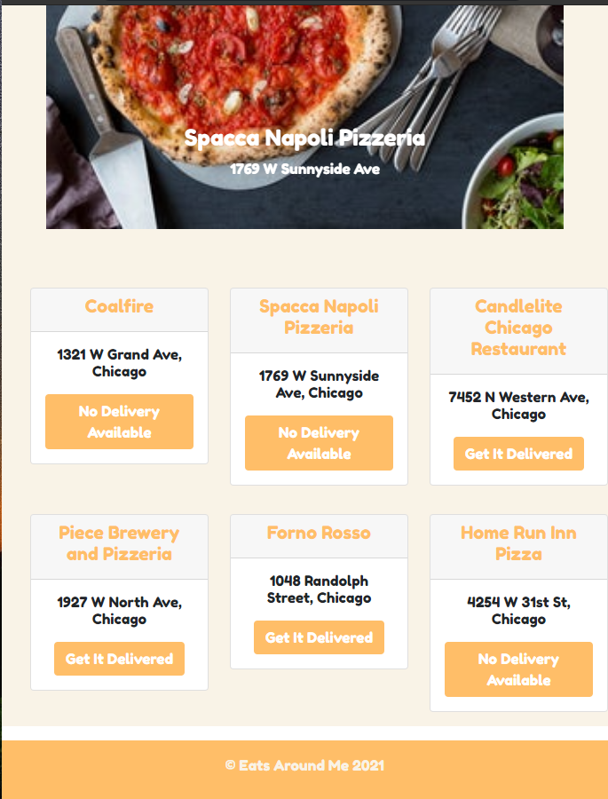
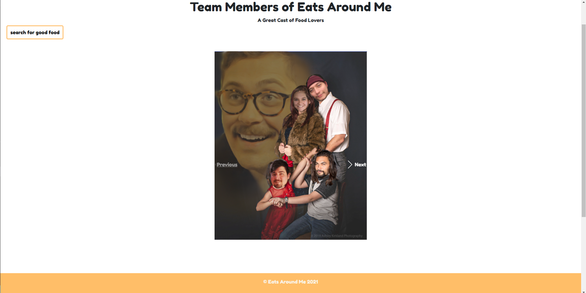
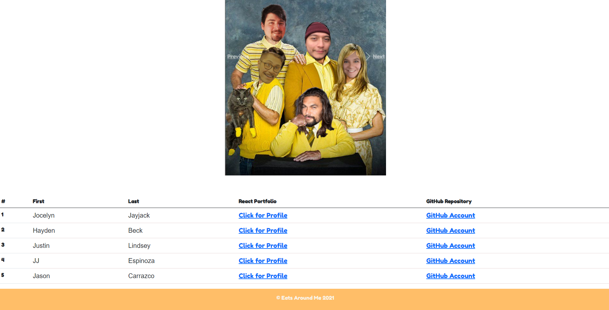
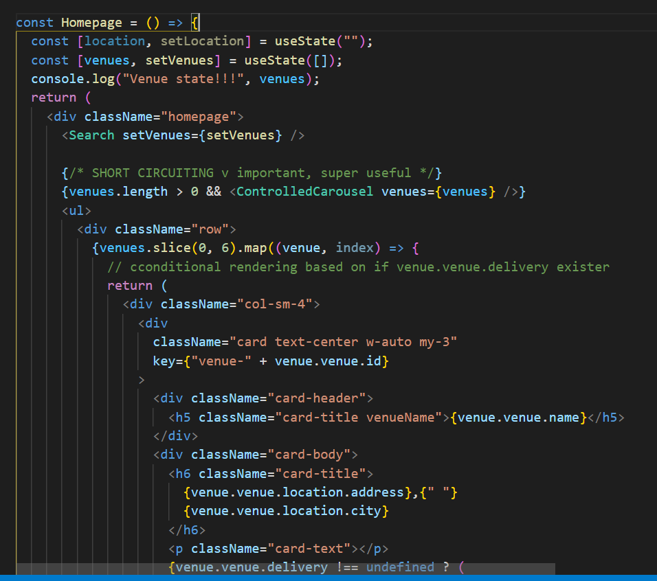
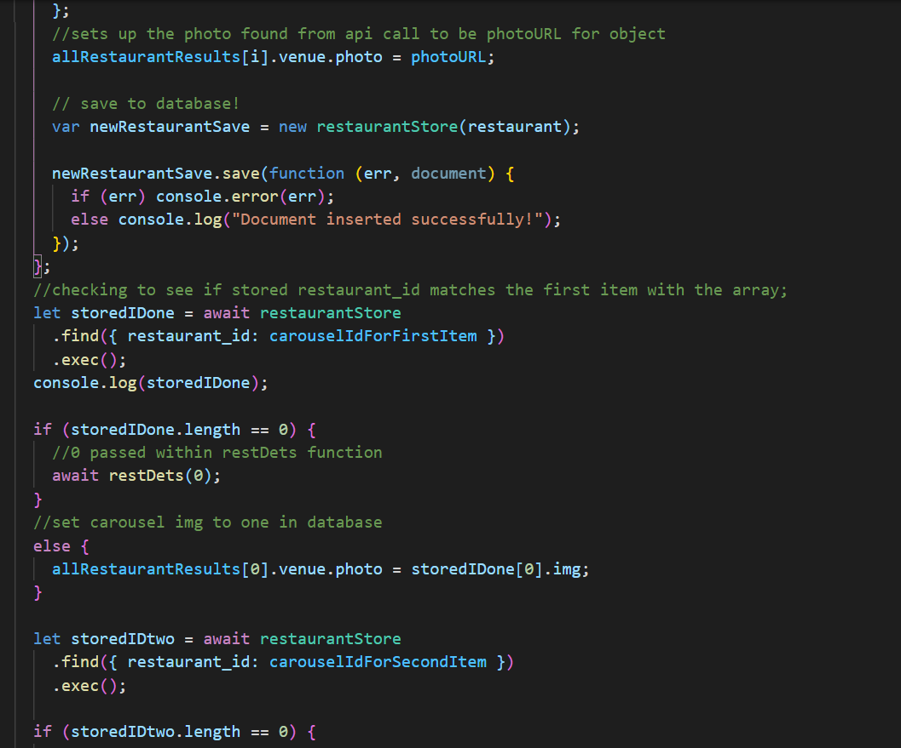

# FoodiesUnite

NU-CHI Project 3

## Live Links:

- Github repo
  https://github.com/jjayjack/FoodiesUnite

- Heroku
  https://foodiesunite.herokuapp.com/

## Contributors

@jjayjack
@haydenabeck
@0117Javi
@JusticeGTR
@AC61090

## Description:

Explore the delicious quisines of Chicago by using our web app to search for any kind of food you can imagine.

## Table of Contents

- [Installation](#installation)
- [Technology Stack](#technology-stack)
- [Usage](#usage)
- [Screenshots](#screenshots)
- [Live Links](#livelinks)
- [Contact](#contact)

## Installation:

NPM install and you're good to go.

## Technology Stack

React, CSS, Foursquare, Bootstrap, Mongoose, Express, Axios, and more. Please take a look at the package.json to see all dependencies.

## Usage:

Login or signup to use our search functionality, powered by Foursquare, to find quisines and delicious foods local to your city!

## Screenshots

- Dashboard
  

- Login
  

- Signup
  

- Search
  

- Search 2
  

- About
  

- About 2
  

- Code of interest: Short Circuiting
  

- Code of interest: Data Scrapping
  

## Contact

- Hayden Beck - haydenabeck@gmail.com
- Jocelyn Jayjack - jocelynjayjack@gmail.com
- Jason Carrazco - carrazcojason10@gmail.com
- JJ Espinoza - j.j.espinozagomez@gmail.com
- Justin Lindsey - justinlindseyLHR@gmail.com
